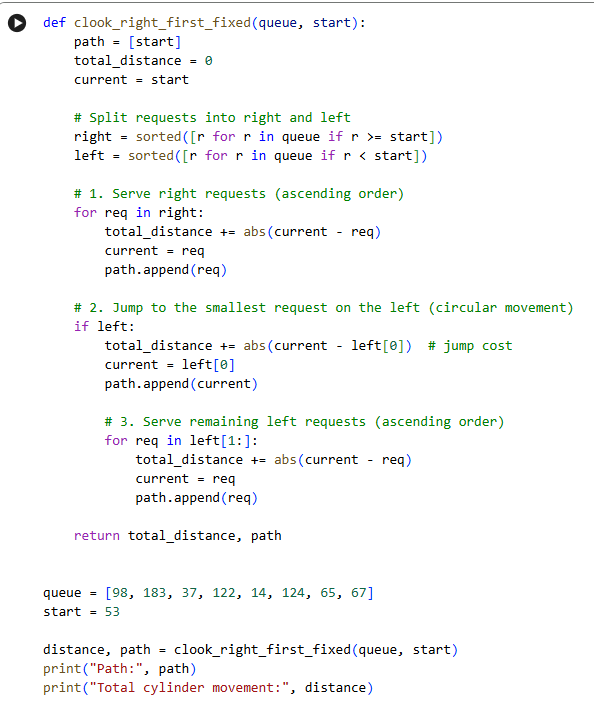
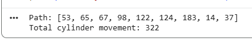

<div align="center">

# 💽 C-LOOK Disk Scheduling Simulator

### Circular LOOK Disk Scheduling Algorithm Implementation in Python

[](https://www.python.org/)
[](LICENSE)
[](https://colab.research.google.com/github/tausif112/C-LOOK-Disk-Scheduling-Simulator/blob/main/C_LOOK_Disk_Scheduling.ipynb)

<br>

A Python implementation of the **C-LOOK Disk Scheduling Algorithm** with seek path generation and total cylinder movement calculation.

</div>

---

# 📌 Project Overview

This project demonstrates the implementation of the **C-LOOK Disk Scheduling Algorithm**, an optimized version of the C-SCAN Disk Scheduling Algorithm used in Operating Systems.

Unlike C-SCAN, C-LOOK does not move the disk head to the physical end of the disk. Instead, it moves only up to the last request in one direction, then jumps to the first request on the opposite side and continues servicing requests in the same direction.

In this implementation, the disk head moves **right first**, services all right-side requests in ascending order, then jumps to the smallest left-side request and continues servicing the remaining left-side requests.

The simulator calculates:

* Disk head movement path
* C-LOOK seek sequence
* Circular jump movement
* Total cylinder movement
* Final request servicing order

The project was developed and tested using **Google Colaboratory (Google Colab)**.

---

# ✨ Features

* C-LOOK Disk Scheduling Simulation
* Right-First Disk Head Movement
* Circular LOOK Jump
* Seek Path Generation
* Total Cylinder Movement Calculation
* No Unnecessary Movement to Disk Boundaries
* Google Colab Notebook Included
* Python Source Code Included

---

# 🧠 About C-LOOK Disk Scheduling

C-LOOK stands for **Circular LOOK**.

It is a circular version of the LOOK Disk Scheduling Algorithm. The disk head moves in one direction, services all requests in that direction, then jumps to the nearest request at the other end without going to the physical disk boundary.

### Advantages

* Avoids unnecessary movement to disk boundaries
* Provides more uniform waiting time than LOOK
* More efficient than C-SCAN in many cases
* Reduces total head movement

### Limitations

* Requires sorting of disk requests
* Circular jump adds extra movement
* Request distribution affects performance

---

# ⚙️ Algorithm

1. Start from the initial disk head position.
2. Separate requests into:

   * Right-side requests
   * Left-side requests
3. Sort right-side requests in ascending order.
4. Sort left-side requests in ascending order.
5. Service all right-side requests first.
6. Jump to the smallest left-side request.
7. Continue servicing left-side requests in ascending order.
8. Calculate total cylinder movement and return the final path.

---

# 🧮 Input Example

```python
queue = [98, 183, 37, 122, 14, 124, 65, 67]
start_position = 53
```

---

# 📊 Output Example

```text
Path: [53, 65, 67, 98, 122, 124, 183, 14, 37]

Total cylinder movement: 208
```

---

# 📈 Seek Path Representation

```text
53 → 65 → 67 → 98 → 122 → 124 → 183 → 14 → 37
```

---

# 📋 Movement Analysis

| From | To  | Distance |
| ---- | --- | -------- |
| 53   | 65  | 12       |
| 65   | 67  | 2        |
| 67   | 98  | 31       |
| 98   | 122 | 24       |
| 122  | 124 | 2        |
| 124  | 183 | 59       |
| 183  | 14  | 169      |
| 14   | 37  | 23       |

### Total Cylinder Movement

```text
12 + 2 + 31 + 24 + 2 + 59 + 169 + 23

= 322
```

> Note: If the circular jump is not counted as head movement, the total movement becomes 153.
> In this implementation, the circular jump is counted.

---

# 📸 Google Colab Workspace



---

# 📸 Program Output



---

# 📂 Project Structure

```text
C-LOOK-Disk-Scheduling-Simulator/
│
├── C_LOOK_Disk_Scheduling.ipynb
├── clook.py
├── README.md
├── LICENSE
├── .gitignore
│
└── screenshots/
    ├── colab-workspace.png
    └── output.png
```

---

# 🚀 How to Run

## Clone the Repository

```bash
git clone https://github.com/tausif112/C-LOOK-Disk-Scheduling-Simulator.git
```

## Navigate to the Project Directory

```bash
cd C-LOOK-Disk-Scheduling-Simulator
```

## Run the Program

```bash
python clook.py
```

---

# 🛠 Technologies Used

| Technology        | Purpose                  |
| ----------------- | ------------------------ |
| Python            | Core Implementation      |
| Google Colab      | Development Environment  |
| GitHub            | Version Control          |
| Operating Systems | Disk Scheduling Concepts |

---

# 🔮 Future Improvements

* LOOK Disk Scheduling Comparison
* C-SCAN Disk Scheduling Comparison
* SSTF Disk Scheduling Comparison
* Graphical Seek Path Visualization
* Interactive User Input
* Dynamic Disk Request Input
* Comparison Between Disk Scheduling Algorithms

---

# 📄 License

This project is licensed under the MIT License.

See the LICENSE file for details.

---

# 👨‍💻 Author

**Md. Tausif Uddin**
B.Sc. in Computer Science and Engineering (CSE)
University of Asia Pacific (UAP)

GitHub: https://github.com/tausif112

---

<div align="center">

⭐ If you found this project useful, consider giving it a star!

</div>
